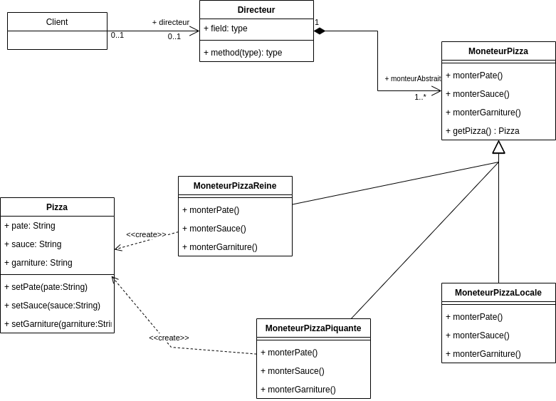

# TP INFO 4067

Nom : **NJIOSSEU TCHOUTCHUI CHARLES LOIC**

Matricule : **20U2659**

## Builder Pattern

On souhaite fabriquer des pizza. On a 3 types de pizza : la pizza
reine, le pizza piquante et la pizza locale,
Pour fabriquer une pizza : on prépare la pate, on prépare et ajoute
une sauce et on prépare et ajoute une garniture.

- pour la pizza reine, on utilise : pate = « croisée », sauce = « douce » et garniture = « jambon et champignon »

- pour la pizza piquante, on utilise : pate = « feuilletée », sauce=
« piquante » et garniture = « pepperoni + salami »

- pour la pizza locale, on utilise : pate = « locale », sauce = « jaune » et garniture = « ... »

On veut utiliser le design pattern Builder pour faciliter la fabrication
des pizza.

1. Proposer une modélisation sous forme de diagramme de classe
2. Proposer le code source correspondant.

### Diagramme de classe EXO_3

