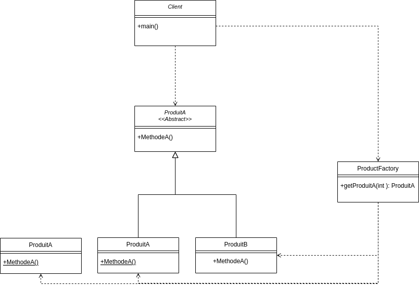
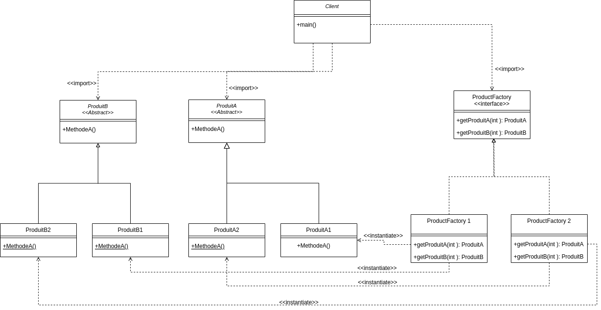
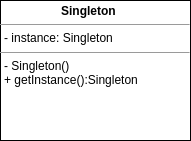
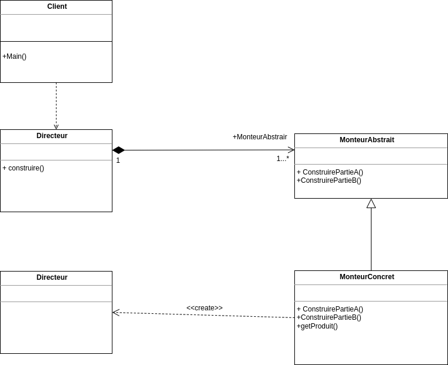

# TP INFO 4067

## **À Propos**

Ce projet vise à mettre en œuvre différents modèles de conception dans le cadre de l'UE INF4067 intitule UML et Design pattern. Vous trouverez des détails spécifiques pour chaque implémentation dans ce document. Le code de ce projet est stocke dans un repositry github à l'adresse: **https://github.com/Codeur16/Design_pattern_INF4067.git**

Bienvenue dans le monde Java VS Code. Voici un guide pour vous aider à commencer à écrire du code Java dans Visual Studio Code.

## Structure du dossier 

The workspace contains two folders by default, where:

- `src`: le dossier pour conserver les sources
  - `.com`: le dossier contenant les packages du projet, et chaque package correspond a une implementation d'un DP
    - `abstractfactory`: le dossier contenant le pattern **Abstract factory**
    - `Builder`: le dossier contenant le pattern **Builder**
    - `factorymethod`: le dossier contenant le pattern **factorymethod**
    - `factorymethod_3_product`: le dossier contenant le pattern **Abstract factory** avec une implementation de 3 produits
    - `singleton`: le dossier contenant le pattern **Singleton**
  
  > Pendant ce temps, les fichiers de sortie compilés seront générés par défaut dans le dossier « bin ».

## Dependency Management

The `JAVA PROJECTS` view allows you to manage your dependencies. More details can be found [here](https://github.com/microsoft/vscode-java-dependency#manage-dependencies).


## COMMENCER:
- [TP INFO 4067](#tp-info-4067)
  - [**À Propos**](#à-propos)
  - [Structure du dossier](#structure-du-dossier)
  - [Dependency Management](#dependency-management)
  - [COMMENCER:](#commencer)
  - [**Prérequis**](#prérequis)
  - [**Tests**](#tests)
  - [1. **Pattern Factory**](#1-pattern-factory)
    - [1.1.  **Utilisation d'une méthode de fabrique (Abstract Factory)**](#11--utilisation-dune-méthode-de-fabrique-abstract-factory)
    - [1.2.    **Utilisation d'une classe abstraite de fabrique (Factory)**](#12----utilisation-dune-classe-abstraite-de-fabrique-factory)
  - [2. **Abstract Factory**](#2-abstract-factory)
  - [3. **Singleton**](#3-singleton)
  - [4. **Builder**](#4-builder)


##  **Prérequis**

Assurez-vous d'avoir l'environnement Java correctement installé (JDK, JRE). Suivez les instructions d'installation disponibles sur Java.com.

##  **Tests**

Le projet est divise en dossier situer a la racine, chaque dossier correspond a l'implementation d'un pattern de construction. Pour effectuer les tests, il faut d'abord cloner le projet dans votre environment, puis lancer en temps que appli JAVA


## 1. **Pattern Factory**

Le Pattern Factory est un modèle de construction permettant de créer des objets dont le type dépend du contexte. Il est utilisé lorsque le client ne peut pas déterminer préalablement le type d'objet à créer, le déterminant uniquement à l'exécution.


    
 ### 1.1.  **Utilisation d'une méthode de fabrique (Abstract Factory)**
Dans ce cas, une fabrique concrète contient une méthode de fabrication où un switch case ou des if déterminent l'objet à créer. Une classe produit abstraite est utilisée pour instancier les sous-classes concrètes.
> Client-factory2.java:
 ```java
package com.factorymethod;

public class Client {
    public static void main(String[] args) throws Exception {
        // System.out.println("Hello, World!");
        Productfactory productfactory = new Productfactory();
        ProduitA produitA = null;

        produitA = productfactory.getProduit(productfactory.TYPE_PRODUITA1);
        produitA.MethodeA();

        produitA = productfactory.getProduit(productfactory.TYPE_PRODUITA2);
        produitA.MethodeA();

        produitA = productfactory.getProduit(0);
        produitA.MethodeA();
    }
}
 
 ```

> Resultat apres execution du client.java:
   - Je suis un Produit A1
   - ProduitA1.MethodeA
   - Je suis un Produit A2
   - ProduitA1.MethodeA2

> Diagramme de classe



 ### 1.2.    **Utilisation d'une classe abstraite de fabrique (Factory)**
Une fabrique abstraite contient les signatures des méthodes de fabrication, avec des fabriques concrètes pour chaque type d'objet. Une classe produit abstraite est utilisée pour instancier les sous-classes concrètes.

> Client-factory3.java:
 ```java
package com.factorymethod_3_product;

public class Client {
    public static void main(String[] args) throws Exception {
        // System.out.println("Hello, World!");
        Productfactory productfactory = new Productfactory();
        ProduitA produitA = null;

        produitA = productfactory.getProduit(productfactory.TYPE_PRODUITA1);
        produitA.MethodeA();

        produitA = productfactory.getProduit(productfactory.TYPE_PRODUITA2);
        produitA.MethodeA();

        produitA = productfactory.getProduit(productfactory.TYPE_PRODUITA3);
        produitA.MethodeA();

        produitA = productfactory.getProduit(0);
        produitA.MethodeA();
    }
}
 
 ```

> Resultat apres execution du client.java:
   - Je suis un Produit A1
   - ProduitA1.MethodeA
   - Je suis un Produit A2
   - ProduitA1.MethodeA2
   - Je suis un Produit A3
   - ProduitA1.MethodeA3

## 2. **Abstract Factory**

L'Abstract Factory est utilisée pour créer des objets regroupés en famille sans connaître leurs classes concrètes. 
 > Client-Abstractfactory.java:
 ```java
  package com.abstractfactory;

import com.abstractfactory.Produit.ProduitA;
import com.abstractfactory.Produit.ProduitB;
import com.abstractfactory.ProduitFactory.ProduitFactory1;
import com.abstractfactory.ProduitFactory.ProduitFactory2;

public class Client {
    public static void main(String[] args) throws Exception {
        // System.out.println("Hello, World!");
        ProduitFactory1 produitfactory1 = new ProduitFactory1();
        ProduitFactory2 produitfactory2 = new ProduitFactory2();
        ProduitA produitA = null;
        ProduitB produitB = null;

        System.out.println("Utilisation de la premiere fabrique");
        produitA = produitfactory1.getProduitA();
        produitB = produitfactory1.getProduitB();
        produitA.methodeA();
        produitB.methodeB();

        System.out.println("Utilisation de la seconde fabrique");
        produitA = produitfactory2.getProduitA();
        produitB = produitfactory2.getProduitB();
        produitA.methodeA();
        produitB.methodeB();
    }
}
  ```
> Resultat apres execution du client.java:
  - Utilisation de la premiere fabrique
  - Je suis un produit A1
  - ProduitA1.MethodeA
  - Je suis un produit B1
  - ProduitB1.MethodeB
  - Utilisation de la seconde fabrique
  - Je suis un produit A2
  - ProduitA2.MethodeA
  - Je suis un produit B2
  - ProduitB2.MethodeB

> Diagramme de classe




## 3. **Singleton**

Le modèle Singleton garantit qu'une classe possède une seule instance et offre un accès global à celle-ci. 
 > Client-singleton.java:
 ```java
 package com.singleton;

// Une classe de test

public class Clients {
    public static void main(String[] args) {
        int som = Singleton.getInstance().somme(2, 5);
        System.out.printf("la somme est %d", som);
        Singleton s1 = Singleton.getInstance(8, 3);
        s1.affiche();
        Singleton s2 = Singleton.getInstance(5, 9);
        s2.affiche();
    }
}
 
 ```
> Resultat apres execution
  - la somme est 7   Je suis une instance mesvaleurs sont : x = 0 et y = 0
  - Je suis une instance mesvaleurs sont : x = 0 et y = 0

> Diagramme de classe


## 4. **Builder**

Le modèle Builder permet de créer des objets complexes à partir d'objets sources. 

 > Client-Builder.java:
 ```java
 package com.Builder;

public class Client {

    
    public static void main(String[]args){
         Directeur directeur = new Directeur();
        Pizza PizzaReine;
        Pizza PizzaPiquante;

        directeur.construire();
        PizzaReine= directeur.monteurPizzaReine.getPizza();
        PizzaPiquante= directeur.monteurPizzaPiquante.getPizza();
        System.out.println("Pizza Reine OK!!");
        System.out.println("");
        System.out.println("");
        System.out.println("Pizza Picante Ok!!");
        
    }

}

 
 ```
> Resultat apres execution
  - Pizza Reine OK!!


  - Pizza Picante Ok!!
  

> Diagramme de classe

